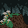
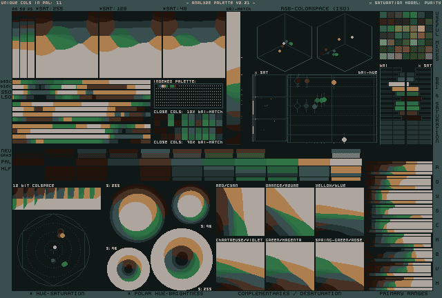

+++
date = '2025-03-04T10:11:34-05:00'
draft = false
title = 'Lospec Daily: Mushroom'
+++
Todays lospec daily:
* theme: mushroom 
* palette: [syz15](https://lospec.com/palette-list/syz15)

Fun fact, didn't use the palette (just forgot).

This was a fun one though.

Started off with just a 16x16 mushroom, plain and simple, and that felt empty so I decided to bump to 32x32, intended to scale to 64x64, to practice backgrounds and colors a bit.

First was the stump since it'll be the focal point. Simple 3 colors of brown and lines in directions that the forming roots would go.

Then moss as it would add a nice character, life, and contrast to the scene.

Mushrooms are simple, 2 colors, flat top, easy.

Background took a bit as I haven't done depth like this before. After lots of searching around, it seems like dark colors are up front, and faded, saturated ones in the back. If the lighting was inverted the depth colors would be too I suppose. In this case though, dark forward helps the stump be stumpy.

It took a good bit of fiddling with the colors to get something that was cool and dark but as a first attempt I think it turned out fine. 

Analysis of the palette in [Dawnbringer](https://lospec.com/palettes/dawnbringer-palette-analyser):

My understanding (btw these can be uploaded to gemini with the image as well and asked to collaborate the understanding):
* Image is thoroughly desaturated which gives room for some elements, specifically the mushroom caps, to go up in saturation (allowing it to pop more). I can't disagree with that and will adjust to see if I can find a better balance.
* Probably can remove the middle or darkest brown (or replace it) as they're too similar.
* Possibly hue shift (move color toward purple slightly) and/or adjust saturation on moss to make it more visibly distinct.
* Play with the stump colors (related to the similar brown point above) to make the details more obvious.

Looking at the image one last time, I agree that mushroom could use a higher contrasting hue or more saturation to make it "pop" more on the moss.

I didn't look at the image a single time at 32x32 while drawing it since that wasn't the output goal but at that size the palette issues are more obvious. The mushroom caps blur together and I would't be surprised if that detail was actually lost entirely on someone without context. Not the worst thing if it was never shown at 32x32 (or viewport 100%) but something worth noting.

So some good lessons learned here though from a simple daily:
* [Dawnbringer](https://lospec.com/palettes/dawnbringer-palette-analyser) is fantastic
  * Couple with an LLM while you're new so long as the goal is to _understand_ what you're looking at and not just asking for corrections.
  * Even if the pixels look good, there's room for improvement
    * Sometimes they're just good enough though -- this was a 30min daily and if the stump with mushrooms came through solid, then I am content
* Background depth is hard
  * Cool colors give a darker more ominous feel
  * Can go darker on the way back if the light source is in the front
  * Can go lighter on the way back if the light source is in the back
  * Hue choice is hard
* Look at the image at multiple scales, including smaller than intended scales
  * It highlights hue imbalance, saturation issues, etc
